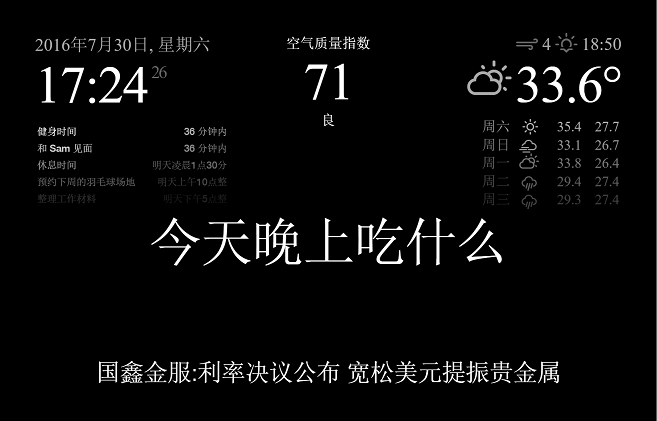
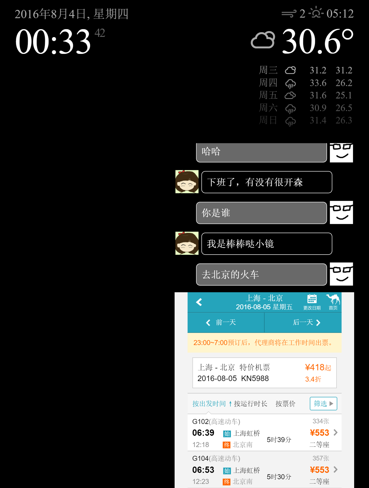

MagicMirror 魔镜
===========

## 说明

本项目为个人定制版魔镜。与[原版](https://github.com/MichMich/MagicMirror)的主要区别有：

- 基于 Java Servlet 重构，全面修改默认程序环境为中文，包括：
	- 语言：中文
	- 时间：24小时制
	- 单位：公制
	- RSS：新浪财经新闻

- 增加人工智能助手功能beta

- 增加语音识别功能pre-alpha

- 增加实时空气质量展示

- 调整配置文件上传方式

- 取消版本自动更新功能

## 使用方法

1. 将本项目 clone 到本地；

2. 将配置文件 `js/config-default.js` 的文件名修改为 `config.js`，或者复制该文件，将新文件重命名为 `config.js`；

3. 在 `config.js` 中根据个人需要修改以下配置信息：
	- 时间格式
	- 所在城市
	- APPID（在 OpenWeatherMap 网站上注册用户获取免费的 APPID）
	- AppKey（在 [PM25.in](http://pm25.in/api_doc) 网站上申请的 AppKey）
	- 欢迎词
	- 最大日程数量及个人日程表链接（iPhone 可以在 iCloud 中将某个日历设为公开日历得到）
	- 新闻 RSS （可自行搜索可用的新闻 RSS）
	- ...

4. 根据个人爱好修改 AI 及用户头像；

5. 编译后台程序（本项目 bin 目录中提供有预编译版本）并启动 Tomcat 服务器。

>完整的软硬件配置说明参考本人博客说明（TBC

## 其他说明

1. 由于某些众所周知的原因，日历功能暂只支持 iPhone；

2. 默认关闭空气质量功能（减少对 PM25.in 网站的无效请求），需要开启请向 [PM25.in](http://pm25.in/api_doc) 网站申请 AppKey 并谨慎使用；

3. 由于天气数据来自国外的 OpenWeatherMap 网站，部分地区数据可能不够准确，请以天气预报或手机上其他天气 APP 为准;

4. 在实时语音识别功能完成开发之前，另外提供了手工访问接口（访问 http://<服务器IP>:8080/server/talk.html 网页），可以手动输入和 AI 对话（略蛋疼的功能）。

## 鸣谢

---

>TBC...